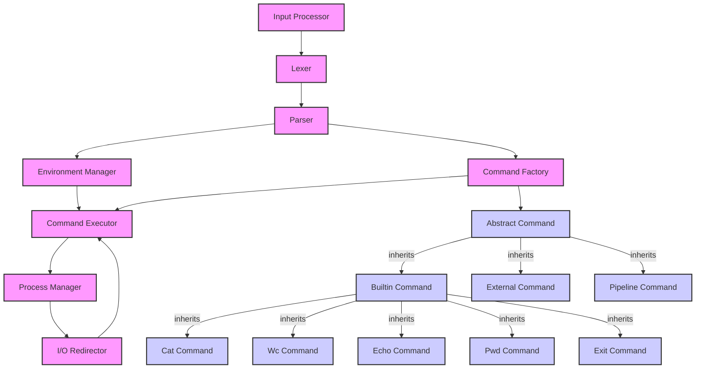

## Архитектурная документация

### 1. Структурная диаграмма

### 2. Словесное описание работы системы

CLI-интерпретатор представляет собой консольное приложение на C++, обеспечивающее выполнение команд пользователя, включая встроенные команды, внешние программы, подстановки переменных окружения, квотирование и пайплайны. Системный поток исполнения начинается с непрерывного запроса пользовательского ввода, обработки его и выполнения соответствующей логики.

#### Основные компоненты и их ответственность:

1.  **Input Processor:**
    *   **Ответственность:** Читает строки пользовательского ввода из стандартного потока ввода. Предоставляет исходную строку для дальнейшей обработки.
    *   **Взаимодействие:** Передает необработанную строку компоненту `Lexer`.

2.  **Lexer:**
    *   **Ответственность:** Токенизирует входную строку. Разбивает исходную строку на последовательность команд, аргументов, операторов, символов кавычек (одинарных и двойных) и подстановки (`$`).
    *   **Особенности:**
        *   **Подстановка до токенизации:** На этом этапе *не происходит* раскрытие переменных окружения. Лексер лишь идентифицирует токены, которые *могут быть* переменными.
        *   **Квотирование:** Лексер отвечает за распознавание начала и конца квотированных строк. Он не снимает кавычки, но помечает токены как квотированные.
    *   **Взаимодействие:** Передает список токенов компоненту `Parser`.

3.  **Parser:**
    *   **Ответственность:** Принимает список токенов от `Lexer` и строит из них объектное представление команды или пайплайна. Валидирует синтаксис.
    *   **Детали парсинга:**
        *   **Подстановки:** На этом этапе происходит разрешение переменных окружения. Токены, помеченные лексером как потенциальные переменные окружения, направляются в `Environment Manager` для получения их значений. Если переменная не найдена, она может быть заменена пустой строкой или вызывать ошибку.
        *   **Квотирование:** Parser снимает кавычки с квотированных токенов.
            *   **Одинарные кавычки (`'`):** Все символы внутри интерпретируются буквально. Подстановки переменных *не происходят*. Экранирование не обрабатывается, все символы остаются как есть.
            *   **Двойные кавычки (`"`):** Символы внутри интерпретируются как строка. Подстановки переменных *происходят*.
        *   **Пайплайны:** Parser распознает оператор `|` и строит структуру, представляющую собой последовательность команд, соединенных пайпами.
    *   **Объектное представление результата разбора:** Создает иерархию наследников `AbstractCommand` для выполнения.
        *   `BuiltinCommand`: Базовый класс для встроенных команд (cat, wc, echo, pwd, exit).
        *   `ExternalCommand`: Класс для внешних программ.
        *   `PipelineCommand`: Композитный класс, содержащий список `AbstractCommand` и управляющий их последовательным выполнением через пайплайны.
    *   **Взаимодействие:** Запрашивает значения переменных у `Environment Manager`. Передает построенный объект команды или пайплайна в `Command Factory`.

4.  **Environment Manager:**
    *   **Ответственность:** Хранит переменные окружения и управляет ими. Предоставляет методы для установки (`name=value`), получения (`$name`) и удаления переменных.
    *   **Реализация:** Синглтон, хранящий `std::map<std::string, std::string>`.
    *   **Изменение окружения:** Команды вида `FILE=example.txt` не являются исполняемыми командами, это инструкции для `Environment Manager`. `Parser` распознает такие паттерны и напрямую вызывает методы `Environment Manager` для установки или изменения переменных.
    *   **Взаимодействие:** Предоставляет значения переменных компоненту `Parser` во время фазы подстановки.

5.  **Command Factory:**
    *   **Ответственность:** Создает конкретные экземпляры объектов команд на основе информации, полученной от `Parser`.
    *   **Логика:** Определяет, является команда встроенной или внешней. Если это встроенная команда, создает соответствующий объект `BuiltinCommand`. Если команда не является встроенной, создает `ExternalCommand`. Если обнаружен пайплайн, создает `PipelineCommand`, который содержит другие команды.
    *   **Взаимодействие:** Возвращает наследника `AbstractCommand` компоненту `Command Executor`.

6.  **Command Executor:**
    *   **Ответственность:** Запускает выполнение команды или пайплана, полученного от `Command Factory`, и управляет им. Отвечает за обработку кодов возврата.
    *   **Последовательность выполнения:**
        *   Для `BuiltinCommand`: вызывает метод `execute()` напрямую у объекта команды.
        *   Для `ExternalCommand`: использует `Process Manager` для форка/исполнения внешней программы.
        *   Для `PipelineCommand`: координирует выполнение нескольких команд, настраивая пайпы между ними через `I/O Redirector` и используя `Process Manager` для каждой внешней составляющей пайплайна.
    *   **Коды возврата:** После завершения любой команды `Command Executor` получает ее код возврата. Этот код может быть использован для будущих расширений, но в текущей реализации просто фиксируется.
    *   **Взаимодействие:** Получает команды от `Command Factory`. Передает внешние команды `Process Manager`. Использует `I/O Redirector` для настройки потоков ввода/вывода.

7.  **Process Manager:**
    *   **Ответственность:** Запускае внешние программы в новых процессах. Ответственен за `fork()` и `exec()` системные вызовы.
    *   **Особенности:**
        *   Вызов внешней программы через `Process` если интерпретатор не знает команду. Это включает поиск исполняемого файла в `PATH` окружении.
        *   Обработка дочерних процессов: ожидание их завершения, сбор кода возврата.
        *   **Многопоточность/многопроцессность:** Для выполнения пайплайнов потребуется запуск нескольких процессов и управление их взаимодействием. Этот компонент будет использовать системные механизмы для этого.
    *   **Взаимодействие:** Запускает процессы по запросу `Command Executor`.

8.  **I/O Redirector:**
    *   **Ответственность:** Управление перенаправлением стандартных потоков ввода, вывода и ошибок для команд.
    *   **Пайпы:** Создание неименованных каналов между процессами. Перенаправление `stdout` одной команды в `stdin` следующей.
    *   **Взаимодействие:** Используется `Command Executor` для настройки I/O для каждой команды перед ее запуском.

#### Поток исполнения (Точки входа)

1.  **Главный цикл CLI:**
    *   Точка входа `main()` инициализирует `Environment Manager` и входит в бесконечный цикл.
    *   В цикле:
        1.  `Input Processor` считывает строку ввода.
        2.  `Lexer` токенизирует строку.
        3.  `Parser` анализирует токены, выполняет подстановки, снимает кавычки и строит объект команды. Если входная строка является инструкцией по изменению окружения (`name=value`), `Parser` напрямую взаимодействует с `Environment Manager` и цикл начинается заново.
        4.  `Command Factory` создает конкретный объект команды.
        5.  `Command Executor` запускает команду.
            *   Если команда - `exit`, CLI завершает работу.
            *   Если команда встроенная, выполняется ее логика.
            *   Если команда внешняя, `Process Manager` создает новый процесс.
            *   Если это `PipelineCommand`, `Command Executor` координирует запуск нескольких процессов через `Process Manager` и настраивает I/O через `I/O Redirector`.
        6.  Обрабатывается код возврата.
    *   Этот цикл продолжается до тех пор, пока не будет получена команда `exit`.

#### Команды и создание команд

*   **Абстрактный класс `AbstractCommand`:** Служит интерфейсом для всех команд. Имеет виртуальный метод `execute(std::istream& stdin, std::ostream& stdout, std::ostream& stderr)`.
    *   **Аргументы и входной поток — разные вещи:** Метод `execute` явно принимает `istream` и `ostream` для потоков ввода-вывода, что позволяет легко перенаправлять их. Аргументы команды (например, filename для `cat`) будут передаваться как часть полей класса-наследника.
*   **Наследники `BuiltinCommand`:**
    *   `CatCommand`: Открывает файл, читает содержимое, пишет в `stdout`.
    *   `WcCommand`: Открывает файл, считает строки/слова/байты, пишет в `stdout`.
    *   `EchoCommand`: Принимает аргументы, пишет их в `stdout` (обрабатывая `\n` как часть выводимой строки, если он не был разрешён парсером).
    *   `PwdCommand`: Использует системные вызовы для получения текущей директории, пишет в `stdout`.
    *   `ExitCommand`: Устанавливает флаг завершения работы интерпретатора.
*   **Наследник `ExternalCommand`:**
    *   Инкапсулирует имя внешней программы и ее аргументы. Метод `execute` этого класса взаимодействует с `Process Manager` для запуска программы.
*   **Наследник `PipelineCommand`:**
    *   Содержит список `AbstractCommand`. Метод `execute` этого класса координирует выполнение команд в списке:
        1.  Для каждой команды, кроме последней, `I/O Redirector` создает pipe.
        2.  `stdout` текущей команды перенаправляется в `stdin` следующей.
        3.  `Process Manager` запускает внешние команды в отдельных процессах.
        4.  Ожидает завершения всех команд в пайплайне.

#### Обработка ошибок

*   Коды возврата: Каждая команда должна возвращать целочисленный код возврата (0 для успеха, ненулевое значение для ошибки). `Command Executor` должен сохранять этот код.
*   Сообщения об ошибках: При ошибках соответствующие компоненты должны выводить информативные сообщения в `stderr`.

#### Многопоточность

Для реализации пайплайнов потребуется использовать системные вызовы для создания дочерних процессов. Каждый процесс в пайплайне будет выполняться параллельно. `Command Executor` и `Process Manager` будут ответственны за синхронизацию и ожидание завершения этих процессов. В контексте самого CLI-интерпретатора, основной поток будет ожидать завершения *всех* процессов в пайплайне, прежде чем принять следующий ввод пользователя.
